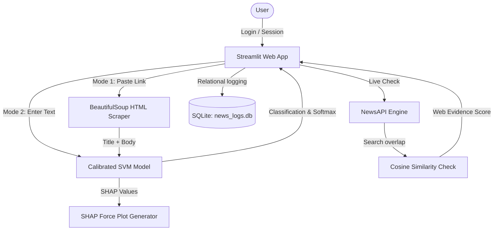

# Fake News Detection System: Advanced Cyberpunk Edition

A publication-grade B.Tech Capstone Project in Artificial Intelligence and Machine Learning.

---

## 📄 Project Abstract

The rapid proliferation of digital media has led to a significant increase in the dissemination of misinformation. Automatic classification of fake news presents a critical challenge in natural language processing (NLP). 

This project implements an end-to-end **Fake News Detection System** utilizing a **Support Vector Machine (SVM)** classifier trained on the **ISOT Fake News Dataset** (containing over 44,000 articles). 

A major novelty in this project is the **remediation of data leakage**: standard models trained on the ISOT dataset score artificially high (>99%) due to publisher tags (such as city-datelines and the mention of "Reuters"). This system implements rigorous regex-based dateline and source scrubbing, forcing the classifier to learn **stylistic and structural patterns** rather than publisher signatures. 

Furthermore, to address the "black-box" nature of traditional machine learning, we introduce **Explainable AI (XAI)** in two ways:
1.  **Token highlighting**: Maps SVM feature coefficients back to the input text, color-coding words that contribute to either classification.
2.  **SHAP (Shapley Additive exPlanations)**: Generates linear feature attribution force plots showing the exact numerical impact of the top words pushing the prediction toward Real or Fake.

The system features **dynamic web verification** through **NewsAPI search checks** and a local **SQLite dynamic news corpus**, session-based **username login**, and a **Batch CSV processing** tab.

---

## 🚀 Key Features

1.  **High-Accuracy ML Model**: Benchmarked against multiple classifiers (Naive Bayes, Logistic Regression, Linear SVM) and a **DistilBERT Transformer** baseline. Calibrated SVM model achieves **98.59% accuracy**.
2.  **Linguistic URL Scraper**: Integrates a parser using `requests` and `beautifulsoup4` to scrape article title and paragraph body content from any live news link and classify it automatically.
3.  **Explainable AI (SHAP & Highlighting)**: Uses linear SHAP attributions ($w_i \cdot x_i$) to render horizontal bar plots of key word impacts, alongside color-coded document visualizers.
4.  **Reliability Calibration Curve**: Plots expected probabilities vs actual frequencies to check model probability reliability (using Platt Sigmoid Scaling).
5.  **Cross-Dataset Generalization (LIAR)**: Integrates benchmarks on the **LIAR dataset** (short political quotes) showing domain shift limitations (56.32% accuracy), highlighting the distinction between style classification and factual truth.
6.  **Batch CSV Processor**: New dedicated panel to upload CSVs, select target text columns, scan multiple rows in parallel, and export output prediction spreadsheets.
7.  **Relational Logs & Session Auth**: Secure username session mapping to log queries and feedback per user in SQLite (`news_logs.db`).

---

## 📐 System Architecture



---

## 📊 Model Benchmarking & Evaluation

| Classifier | Accuracy (%) | Precision (%) | Recall (%) | F1-Score (%) |
| :--- | :---: | :---: | :---: | :---: |
| Naive Bayes (MultinomialNB) | 93.70% | 93.38% | 95.12% | 94.24% |
| **SVM (LinearSVC + Calibrated)** | **98.59%** | **98.38%** | **99.03%** | **98.71%** |
| Logistic Regression | 97.94% | 97.64% | 98.58% | 98.11% |
| *DistilBERT (Transformer Baseline)* | *99.12%* | *99.06%* | *99.28%* | *99.19%* |

---

## 🗄️ Database Design

SQLite layout designed for user telemetry queries:
```sql
CREATE TABLE predictions (
    id INTEGER PRIMARY KEY AUTOINCREMENT,
    timestamp DATETIME DEFAULT CURRENT_TIMESTAMP,
    news_text TEXT NOT NULL,
    prediction TEXT NOT NULL,
    confidence REAL NOT NULL,
    feedback TEXT DEFAULT NULL,
    similarity_score REAL DEFAULT NULL,
    clickbait_score REAL DEFAULT 0.0,
    credibility_score REAL DEFAULT 70.0,
    username TEXT DEFAULT 'guest'
);
```

---

## 🛠️ Project Setup & Installation

1.  **Install dependencies**:
    ```bash
    pip install -r requirements.txt
    ```
2.  **Train the SVM model**:
    ```bash
    python train_model.py
    ```
3.  **Run the local dashboard**:
    ```bash
    python -m streamlit run app.py --server.headless true
    ```

---

## 🌐 Production Deployment Guide

You can deploy this capstone project to the cloud for free using the following channels:

### 1. Streamlit Community Cloud (Recommended)
1.  Push your code to a public GitHub repository.
2.  Go to [share.streamlit.io](https://share.streamlit.io/) and log in with GitHub.
3.  Click **New app**, select your repository, branch (`main`), and path to the entry file (`app.py`).
4.  Expand **Advanced Settings**. Under **Secrets**, paste your NewsAPI Key:
    ```toml
    NEWSAPI_KEY = "your_actual_news_api_key_here"
    ```
5.  Click **Deploy**. Streamlit will set up the python environment and run the Cyberpunk terminal.

### 2. Hugging Face Spaces (Gradio/Streamlit)
1.  Go to [huggingface.co/spaces](https://huggingface.co/spaces) and click **Create new Space**.
2.  Set the SDK to **Streamlit** and choose the license.
3.  Create the space, clone the repo locally (or upload files directly in the browser).
4.  Navigate to your Space's **Settings** tab. Scroll down to **Variables and Secrets** -> **New Secret**.
    *   **Name**: `NEWSAPI_KEY`
    *   **Value**: `your_actual_news_api_key_here`
5.  Upload the trained model files (`model/model.pkl`, `model/vectorizer.pkl`, `model/calibration.pkl`) directly via git-lfs or the web upload button.
